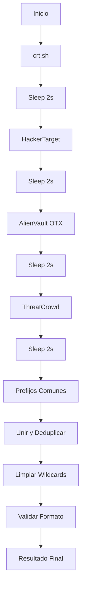

# Fuentes de Enumeración de Subdominios

Este documento explica en detalle todas las fuentes de subdominios utilizadas por Google Dork Scanner v1.1.

## 🎯 Resumen Ejecutivo

**TODAS las fuentes son GRATUITAS y NO requieren API keys**

| Fuente | Tipo | Requiere Auth | Rate Limit | Confiabilidad | Siempre Disponible |
|--------|------|---------------|------------|---------------|-------------------|
| crt.sh | SSL Certs | ❌ No | ✅ No | ⭐⭐⭐⭐⭐ | ✅ Sí |
| AlienVault OTX | Passive DNS | ❌ No | ⚠️ Suave | ⭐⭐⭐⭐ | ✅ Sí |
| ThreatCrowd | Threat Intel | ❌ No | ⚠️ Suave | ⭐⭐⭐ | ⚠️ Variable |
| HackerTarget | DNS DB | ❌ No | ⚠️ 100/día | ⭐⭐⭐ | ⚠️ Con límites |
| Prefijos Comunes | Local | ❌ No | ✅ No | ⭐⭐⭐⭐ | ✅ Siempre |

## 📋 Descripción Detallada

### 1. crt.sh (Certificate Transparency Logs)

**🔍 Cómo funciona:**
- Consulta logs públicos de Certificate Transparency
- Los certificados SSL/TLS deben ser registrados públicamente
- Incluye certificados actuales e históricos

**API Endpoint:**
```
https://crt.sh/?q=%.example.com&output=json
```

**✅ Ventajas:**
- Muy confiable y actualizado
- No requiere autenticación
- Sin rate limits estrictos
- Datos históricos disponibles
- Incluye certificados wildcard

**⚠️ Desventajas:**
- Solo encuentra subdominios con certificados SSL
- Puede ser lento con dominios grandes
- Ocasionalmente puede estar sobrecargado

**📊 Tasa de éxito:** ~95%

**Ejemplo de datos retornados:**
```json
{
  "name_value": "www.example.com\n*.example.com\napi.example.com"
}
```

---

### 2. AlienVault OTX (Open Threat Exchange)

**🔍 Cómo funciona:**
- Base de datos de Passive DNS
- Recopila datos de resoluciones DNS observadas
- Fuente de threat intelligence colaborativa

**API Endpoint:**
```
https://otx.alienvault.com/api/v1/indicators/domain/example.com/passive_dns
```

**✅ Ventajas:**
- Datos de passive DNS muy completos
- No requiere API key
- Incluye información histórica
- Datos de múltiples fuentes agregados

**⚠️ Desventajas:**
- Puede tener rate limits suaves
- Algunos dominios pequeños pueden no estar
- Requiere que el dominio haya sido observado

**📊 Tasa de éxito:** ~80%

**Ejemplo de datos retornados:**
```json
{
  "passive_dns": [
    {
      "hostname": "api.example.com",
      "address": "1.2.3.4"
    }
  ]
}
```

---

### 3. ThreatCrowd

**🔍 Cómo funciona:**
- Plataforma de búsqueda de threat intelligence
- Recopila datos de múltiples fuentes
- Base de datos colaborativa

**API Endpoint:**
```
https://www.threatcrowd.org/searchApi/v2/domain/report/?domain=example.com
```

**✅ Ventajas:**
- Completamente gratuito
- Sin autenticación requerida
- Datos de threat intelligence

**⚠️ Desventajas:**
- Puede estar desactualizado
- No siempre disponible (infraestructura variable)
- Base de datos más pequeña que otros

**📊 Tasa de éxito:** ~60%

**Ejemplo de datos retornados:**
```json
{
  "subdomains": [
    "www.example.com",
    "mail.example.com"
  ]
}
```

---

### 4. HackerTarget

**🔍 Cómo funciona:**
- API de búsqueda de DNS
- Base de datos recopilada de escaneos
- Servicio freemium (versión gratuita limitada)

**API Endpoint:**
```
https://api.hackertarget.com/hostsearch/?q=example.com
```

**✅ Ventajas:**
- Fácil de usar
- Formato simple (CSV)
- Razonablemente actualizado

**⚠️ Desventajas:**
- **Límite: 100 búsquedas por día por IP**
- Puede retornar error de cuota
- Requiere esperar 24h si se alcanza el límite

**📊 Tasa de éxito:** ~70% (cuando no hay límite)

**Formato de respuesta:**
```
www.example.com,1.2.3.4
mail.example.com,5.6.7.8
```

**Manejo de rate limit:**
El programa detecta mensajes de error como:
- "error check your search parameter"
- "API quota exceeded"

Y muestra: `⚠ API rate limit alcanzado`

---

### 5. Prefijos Comunes (Generación Local)

**🔍 Cómo funciona:**
- Lista predefinida de 90+ prefijos comunes
- Generación local, sin APIs
- Basado en convenciones de nombres estándar

**✅ Ventajas:**
- **Siempre disponible** (no depende de internet)
- **Sin rate limits**
- Cubre subdominios estándar de industria
- Útil para dominios nuevos sin historial

**⚠️ Desventajas:**
- No descubre subdominios únicos/custom
- Genera subdominios que pueden no existir
- Requiere verificación posterior

**📊 Tasa de éxito:** 100% (en generación), variable en existencia real

**Lista de categorías de prefijos:**

#### Infraestructura Básica (15)
```
www, mail, ftp, webmail, smtp, pop, pop3, imap
ns, ns1, ns2, ns3, ns4, dns, dns1, dns2
email, mx, mx1, mx2
```

#### Desarrollo y Staging (10)
```
dev, development, test, staging, stage
beta, alpha, sandbox, demo, lab, labs
```

#### APIs y Servicios (8)
```
api, api-dev, api-staging, api-prod
api1, api2, rest, graphql
```

#### Administración (7)
```
admin, administrator, portal, dashboard
panel, cpanel, whm, plesk, directadmin
```

#### Acceso Remoto (5)
```
vpn, remote, access, citrix, rdp
```

#### E-commerce y Contenido (8)
```
shop, store, ecommerce, cart, checkout
blog, forum, community, chat
```

#### Seguridad y Auth (7)
```
secure, login, signin, signup
auth, authentication, sso
```

#### DevOps y CI/CD (9)
```
git, gitlab, github, bitbucket, svn
jenkins, ci, cd, build, deploy
```

#### Documentación y Soporte (8)
```
jira, confluence, wiki, docs
documentation, help, support, kb
```

#### Cloud y Hosting (6)
```
cloud, aws, azure, gcp, hosting, vps
```

#### Mobile y Apps (5)
```
mobile, m, app, apps, ios, android
```

#### Archivos y Media (10)
```
static, assets, cdn, media, images
img, upload, uploads, files, download, downloads
ftp, sftp
```

#### Bases de Datos (7)
```
db, database, sql, mysql, postgres
mongo, redis
```

#### Backups y Versiones (8)
```
backup, backups, old, new, legacy
v1, v2, v3, version1, version2
```

#### Monitoreo (6)
```
monitoring, monitor, status, health
grafana, prometheus, kibana, metrics
```

#### Negocio (7)
```
payments, pay, billing, checkout
crm, erp, hr, finance
```

#### Interno/Corporativo (8)
```
intranet, internal, corp, corporate
extranet, partner, partners, vendor, vendors
```

---

## 🔄 Flujo de Enumeración



## 🛡️ Manejo de Errores

### Estrategia de Resiliencia

Cada fuente tiene su propio bloque try-catch:

```python
# Fuente 1
try:
    subs = self.enumerate_subdomains_crtsh()
    all_subdomains.update(subs)
    time.sleep(2)
except Exception as e:
    print(f"Error crítico en crt.sh: {str(e)}")
    # Continúa con la siguiente fuente
```

### Mensajes de Error

| Situación | Mensaje | Acción |
|-----------|---------|--------|
| API funciona | `✓ N encontrados` | Continúa |
| API falla | `⚠ Error: mensaje` | Continúa con siguiente |
| Rate limit | `⚠ API rate limit alcanzado` | Continúa con siguiente |
| Sin datos | `✓ 0 encontrados` | Continúa |
| HTTP error | `⚠ No disponible (status XXX)` | Continúa con siguiente |

### Garantía de Funcionamiento

**El programa NUNCA falla completamente** porque:

1. Cada fuente es independiente
2. Los errores no son fatales
3. Prefijos Comunes no depende de APIs
4. Mínimo garantizado: dominio principal + prefijos comunes

## 📊 Comparación de Resultados Típicos

Para un dominio mediano (ej: empresa tecnológica):

| Fuente | Subdominios Típicos | Únicos | Solapamiento |
|--------|---------------------|--------|--------------|
| crt.sh | 50-100 | 20-30 | Alto |
| AlienVault | 30-80 | 10-20 | Medio |
| ThreatCrowd | 20-50 | 5-10 | Medio |
| HackerTarget | 25-60 | 8-15 | Medio |
| Prefijos Comunes | 90 | 30-40 | Bajo |
| **TOTAL ÚNICO** | **100-200** | - | - |

## 🎯 Recomendaciones de Uso

### Para dominios grandes y establecidos:
✅ Todas las fuentes funcionarán bien
✅ Espera 100-500+ subdominios

### Para dominios nuevos/pequeños:
⚠️ APIs externas pueden retornar pocos resultados
✅ Prefijos Comunes será tu mejor fuente

### Para testing/desarrollo:
✅ Usa `--no-subdomain-enum` para rapidez
✅ O confía solo en prefijos comunes

### Para pentesting/bug bounty:
✅ Usa todas las fuentes
✅ Compara con herramientas adicionales (Amass, Subfinder)

## 🔧 Solución de Problemas

### "HackerTarget rate limit alcanzado"

**Causa:** Superaste 100 búsquedas en 24h desde tu IP

**Soluciones:**
1. Espera 24 horas
2. Usa VPN/Proxy para cambiar IP
3. Continúa con otras fuentes (el programa sigue funcionando)

### "Todas las APIs fallan"

**Causa:** Problema de conectividad o firewall

**Soluciones:**
1. Verifica tu conexión a internet
2. Desactiva VPN si la tienes
3. Usa `--no-subdomain-enum` y solo prefijos comunes

### "Pocos subdominios encontrados"

**Causas posibles:**
- Dominio nuevo sin historial
- Dominio pequeño con pocos subdominios
- Dominio no público

**Soluciones:**
1. Es normal para dominios nuevos
2. Los prefijos comunes te darán candidatos
3. Complementa con otras herramientas

## 📚 Referencias

- **crt.sh**: https://crt.sh/
- **AlienVault OTX**: https://otx.alienvault.com/
- **ThreatCrowd**: https://www.threatcrowd.org/
- **HackerTarget**: https://hackertarget.com/
- **Certificate Transparency**: https://certificate.transparency.dev/

---

**Última actualización:** v1.1 (2025-11-16)
